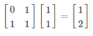
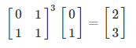
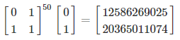
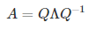

<br>

## Fibonacci Numbers

Fibonacci numbers are numbers generated from a special sequence. The
sequence begins 0, 1, 1, 2, 3, 5, 8, 13, 21, 34 … and continues forever.

The sequence starts with 0 and 1, and each subsequent number is produced
by summing the two previous numbers.

Formally,

<p align="center">

</p>

where *x<sub>i</sub>* is the *i<sup>th</sup>* Fibonacci number, and
*x<sub>i-1</sub>* and *x<sub>i-2</sub>* are the two previous numbers in
the sequence.

<br>

It is simple to compute the Fibonacci numbers by hand (or to write a
computer program to do it). However, to compute a given Fibonacci
number, these methods require computing all the previous numbers in the
sequence.

I will present a well-known method of using linear algebra for computing
any given Fibonacci number in the sequence automatically, without having
to generate the sequence leading up to that number.

In other words, can we, in a single step, compute the 50<sup>th</sup>
Fibonacci Number?

<br>

## Applying Linear Algebra to Generate Fibonacci Numbers

The following matrix **A** is useful to us:

<p align="center">

</p>

If we represent the first two Fibonacci numbers (e.g., 0 & 1) as a
vector and multiply it with our matrix **A** two useful things happen:

<p align="center">

</p>

First, the sum of these two numbers 0 + 1 = 1 appears as the second
element in our new vector. This is useful because this is the next
number in our sequence.

Second, a 1 also appears as our first element in our new vector. This is
useful because our vector now has 1 and 1 (the second and third
Fibonacci numbers), which allows us to multiply this new vector by **A**
to produce the next number in the sequence:

<p align="center">

</p>

Again, we can take this new vector and multiply it by **A** to get the
next number in the sequence:

<p align="center">

</p>

<br>

To do this all in one step, we can multiply our original vector of the
first two Fibonacci numbers (i.e., 0 & 1) by our matrix **A** three
times:

<p align="center">

</p>

This allows us to compute the fifth Fibonacci number. We can write
things more compactly:

<p align="center">

</p>

Here we compute the powers of a matrix. By computing the third power of
the matrix **A**, we can compute the fifth Fibonacci number.

<br>

Similarily, computing the 50<sup>th</sup> power of the matrix **A**, we
can compute the 52<sup>nd</sup> Fibonacci number (as well as the
51<sup>st</sup>):

<p align="center">

</p>

However, this is a lot of multiplication (50 matrix multiplications)!

<br>

## Using the Eigendecomposition of a Matrix to Compute Matrix Powers

The Eigendecomposition of a square matrix decomposes a matrix into three
more fundamental matrices. When these three matrices are multiplied
together they produce the original matrix. This is similar to how a
composite number like 30 can be decomposed into three more fundamental
prime numbers (30 = 2 \* 3 \* 5).

<p align="center">

</p>

In the case of our matrix **A**, the following equation evaluates to:

<p align="center">

</p>

The columns in the first matrix, **Q** are the *eigenvectors* of the
matrix **A**. The second matrix *Λ*, is a diagonal matrix which stores
the *eigenvalues* of **A**. The third matrix ***Q*<sup>−1</sup>** is the
*inverse* of **Q**.

That is, A is re-represented as a rotation (**Q**), a scaling (*Λ*), and
another rotation (***Q*<sup>−1</sup>**).

This is also useful to us. We can now compute any power of the matrix
**A** by simply computing the powers of the eigenvalues in *Λ*.

As an example, we can compute the 50th power of **A** with the
following:

<p align="center">

</p>

Importantly, the powers of the diagonal matrix *Λ* are easily computed
by simply computing the powers of the number in the diagonals (e.g.,
1.618034<sup>50</sup> and -0.618034<sup>50</sup>). This allows us to
compute any power of a matrix with just three matrix multiplications!

<br>

## Applying the Eigendecomposition to Generate any Fibonacci Number

We can now combine a few of these ideas to very simply compute any
Fibonacci number without needing to compute all the numbers of the
sequence that came before.

The following will compute any Fibonacci number automatically!

<p align="center">

</p>

As an example, the following will compute the 51<sup>st</sup> and
52<sup>st</sup> Fibonacci numbers that we computed before with only a
handful of matrix operations (compared to the 50+ matrix operations
without using the eigendecomposition of the matrix **A**):

<p align="center">

</p>

<br>

## Importance

Matrices are used to represent data applicable in science, engineering,
data-science, and machine learning. By re-representing the data (i.e.,
as the eigen vectors and eigen values of a matrix) we can more easily
understand and process the data. This re-representation allows us to
solve problems that would be difficult, time-consuming, or impossible to
solve using other representations.

<br>

## R Code

``` r
# 2x2 matrix
a <- matrix(c(0, 1,
              1, 1), 
            2, 2)

#compute eigen vectors and values
eig <- eigen(a)

#compute the 51st and 52nd Fibonacci numbers
eig$vectors %*% diag(eig$values^50) %*% solve(eig$vectors) %*% c(0, 1)
```

    ##             [,1]
    ## [1,] 12586269025
    ## [2,] 20365011074

<br> <br> <br> <br> <br>
